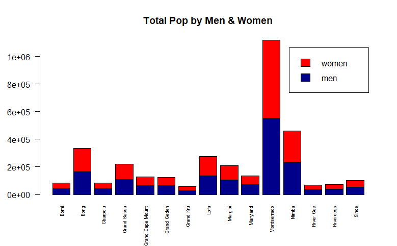
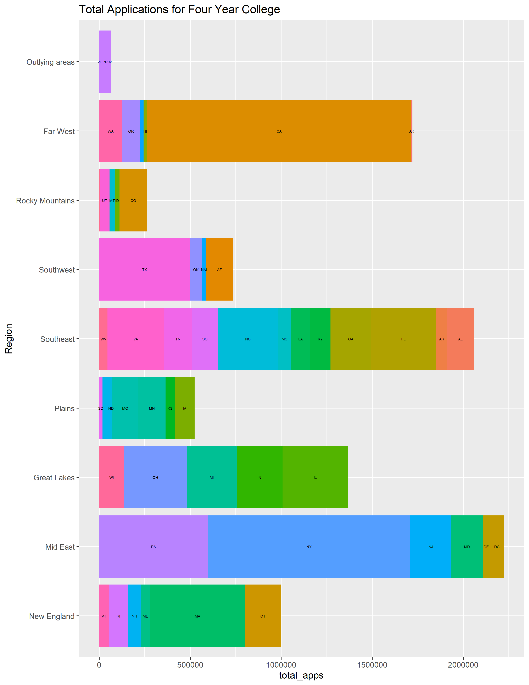

# Data Management Part 1

Created a bar plot that displayed the total population of each county in Liberia while distinguishing between male and female population.

[Pop difference](file:///C:/Users/alexw/OneDrive/Desktop/Wicked%20Problems/lab_1/population_total_dif.pdf)

Created a bar plot displaying the differences in total population. Compares Each county from the data sets.

Created a bar plot displaying the difference in total female population between the two data sets.

Plotted the population density of each country in km2
