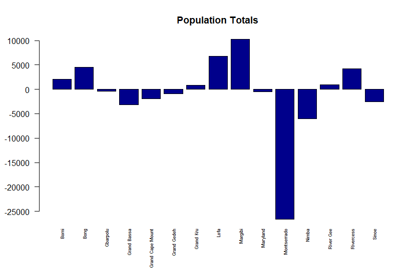
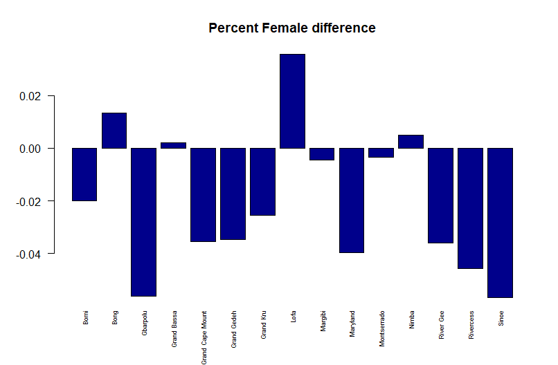
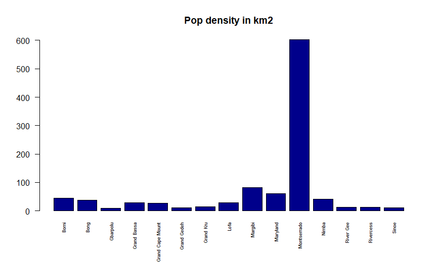

# Data Management Part 1

Created a bar plot that displayed the total population of each county in Liberia while distinguishing between male and female population.

Created a bar plot displaying the differences in total population. Compares Each county from the data sets.

Created a bar plot displaying the difference in total female population between the two data sets.

Plotted the population density of each country in km2.

