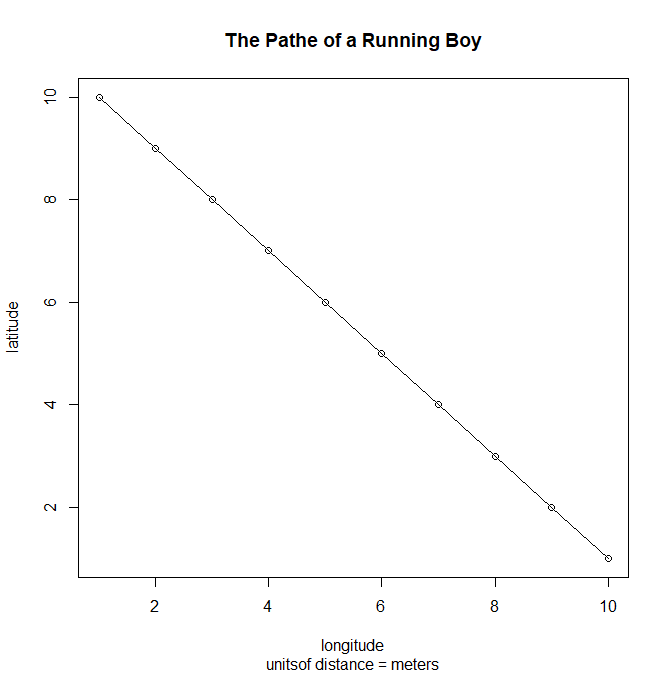

The plot above shows the running path of a boy. I defined x to be the integers from 1 to 10 and y to have the same numbers, in decreasing order. I then plotted the points, connected by a dotted line, and labeled the axes accordingly.

I first created a 100 x 100 plot, where the x-axis represented distance east and the y-axis represented that of north. Using the sample() function, 10 dwellings were randomly selected. These points were stored in a data frame and labeled. Randomly placed trees were also plotted. Using a spline, I connected 3 of the 10 dwellings to show a path between the points.
