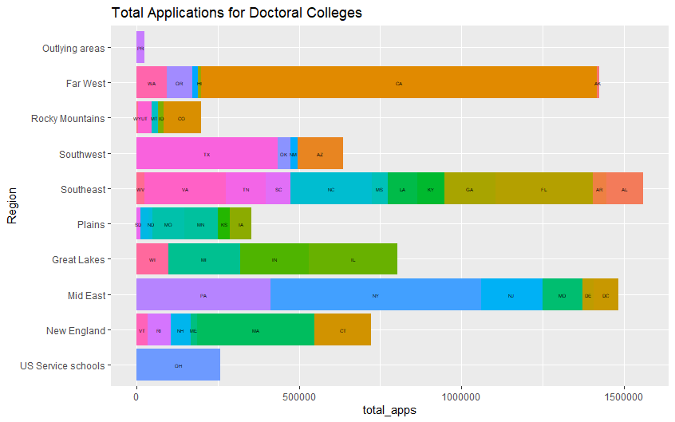

# Part 1

I collected data regarding institutions and their admissions of 2015 from the National Center for Education Statistics’ Data Center website for this section. I narrowed my data analysis to four year colleges and colleges offering docorate degrees. The plots above show the total number of applications per state for a given region of the US.

# Part 2

Using data from the Census API from 2000, 2010, and 2014, I created a plot that showed the changed in population for each state. The four plots are organized in quartiles to better display the data.
