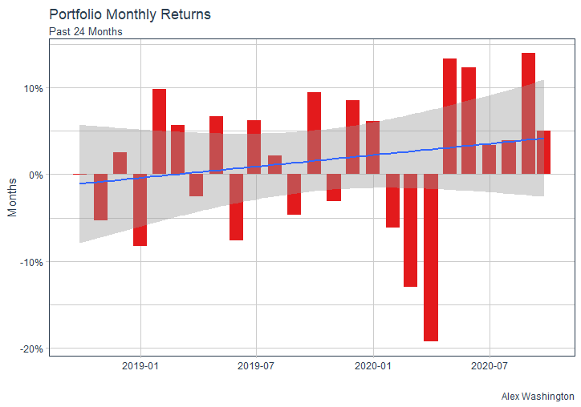

# Project 2

## Part 1: Using the Stock Market to Describe, Analyze and Predict

## Part 2:  Using tidyquant Analyze Stock Performance

A line plot that describes portfolio growth for my five stocks over the past 2 years.

A barplot that describes portfolio returns for my five stocks over the past 2 years.
