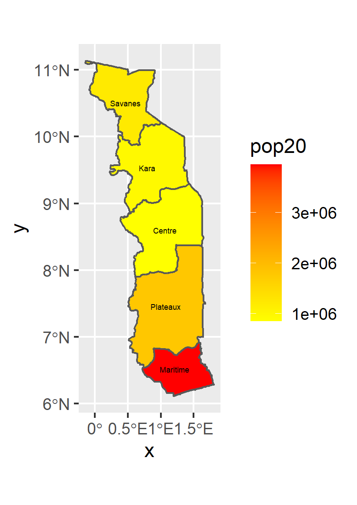
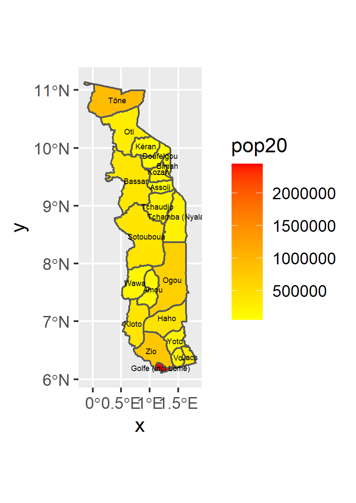
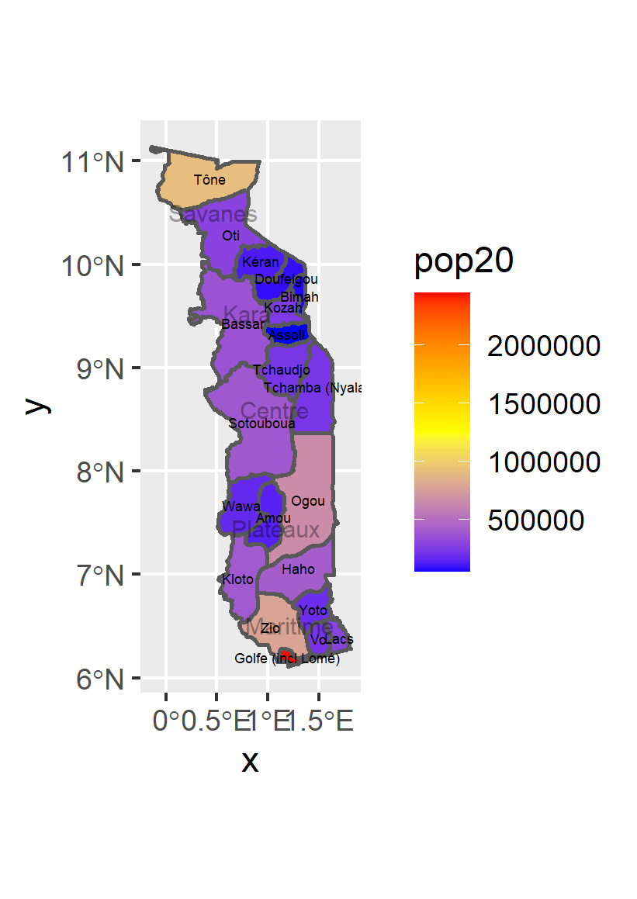

## Deliverable

I extracted the populations from a Raster and then aggregated to each unit.

## Stretch Goal 1

I replicated the raster from the deliverable on togo. This time I used the adm2.

## Stretch Goal 2

For this I combined adm1 and adm2 to create a raster that had both layers of information for the population.

## Stretch Goal 3

3D Model
